# Antibiome PICU — desktop app

A standalone **PICU intelligence** app for the unit's own PC. It wraps the original Antibiome
microbiology module (antibiogram, MDR, trends) in a longitudinal PICU layer: admissions → diagnoses →
respiratory / vasoactive / antimicrobial episodes → events → cultures → outcomes.

- **Runs offline.** Electron app; no server, no internet needed.
- **Local database.** A single SQLite file (Node's built-in `node:sqlite`, so nothing needs compiling),
  in WAL mode with an append-only audit log enforced by database triggers.
- **Fast entry.** Admission takes about 30 s with a visible timer. Bedside changes are one tap on the
  census board. A daily reconcile grid covers the whole unit in about a minute. Discharge takes about 20 s.

See [`../docs/PICU_INTELLIGENCE_PLAN.md`](../docs/PICU_INTELLIGENCE_PLAN.md) for the architecture assessment and roadmap.

## Screens

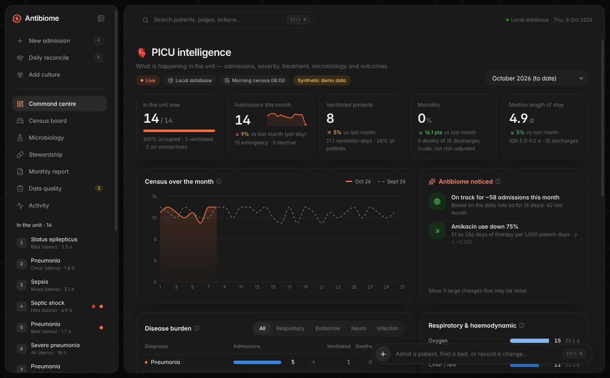

| | |
|---|---|
| 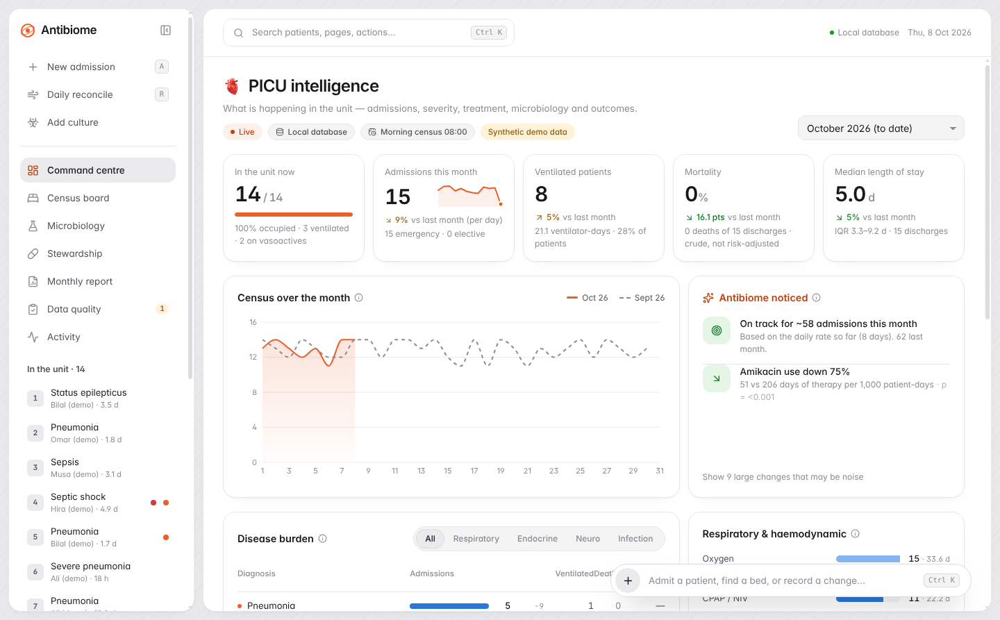 | 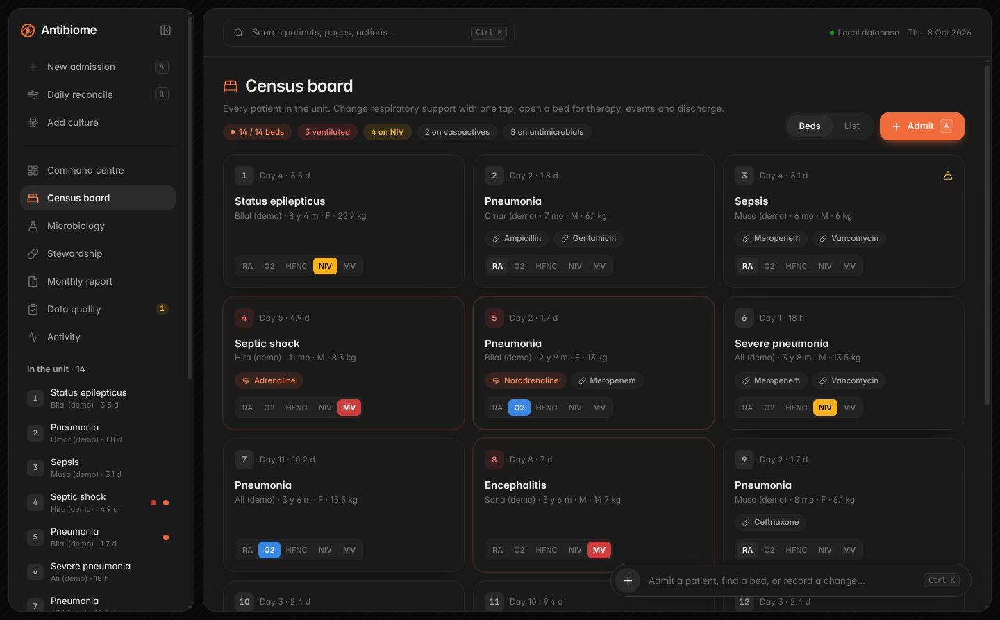 |
| 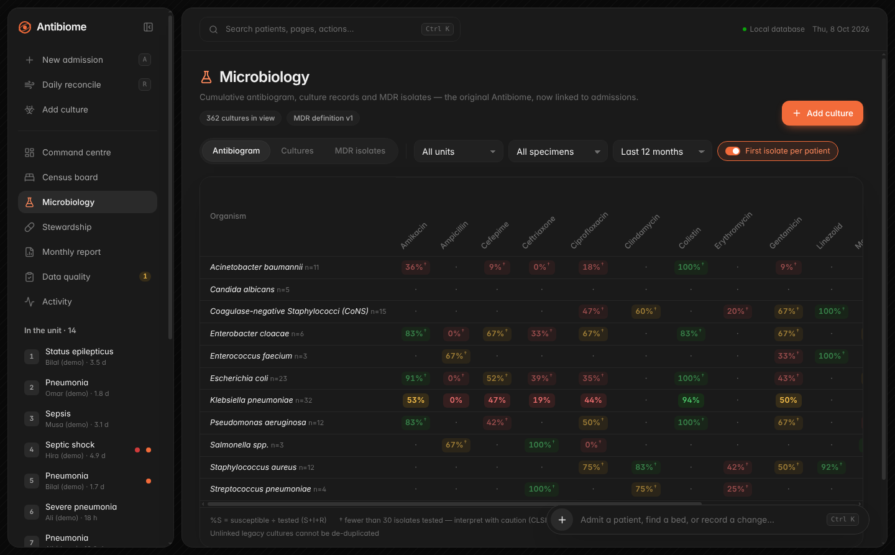 | 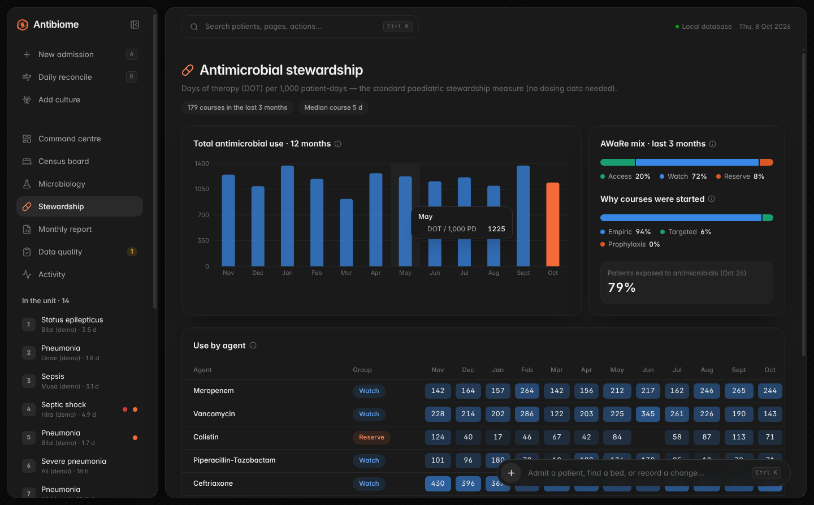 |

| 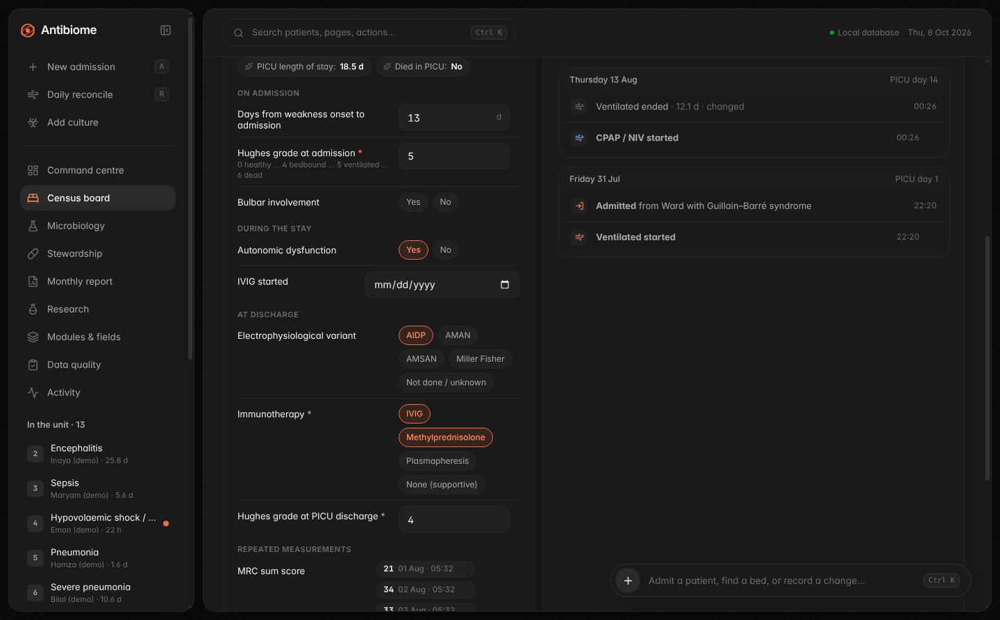 | 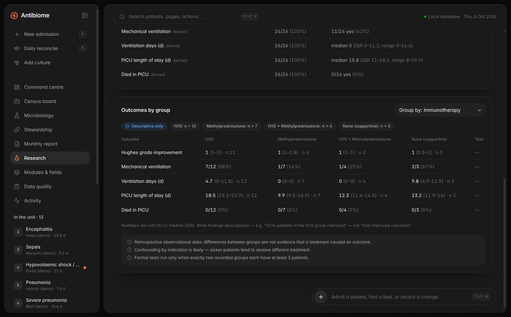 |
| 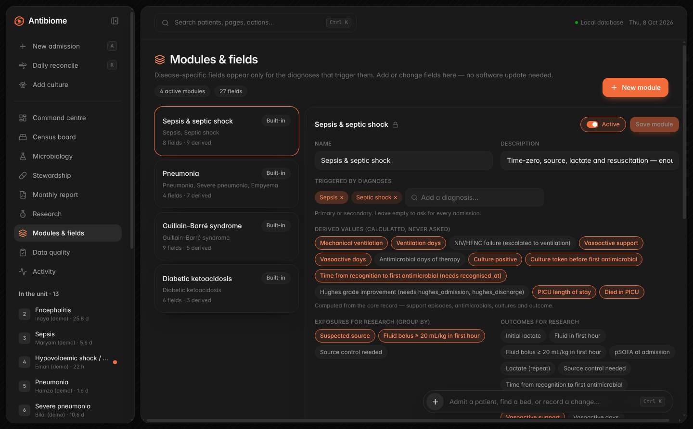 | 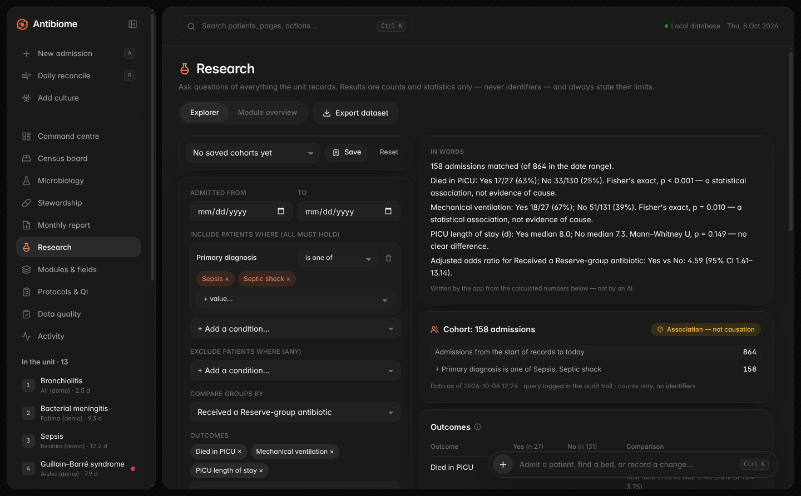 |
| 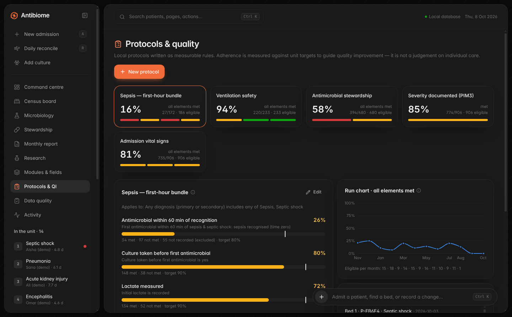 | 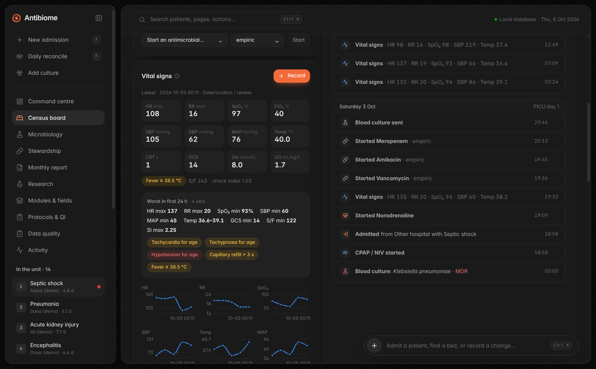 |

*Screenshots use the built-in synthetic demo data.*


| Screen | What it does |
|---|---|
| **Command centre** | KPI tiles (census/occupancy, admissions, ventilated, crude mortality, median LOS); census this month vs last; **“Antibiome noticed”** change cards; disease burden; respiratory & haemodynamic; antimicrobial DOT; MDR trend |
| **Census board** | Bed grid or list; one-tap respiratory support per bed; vasoactive / antimicrobial chips; data-quality and pending-culture flags |
| **Patient** | Current support & therapy, quick events (procedures, complications, culture sent), linked cultures, day-grouped timeline, discharge, edit |
| **Daily reconcile** | Whole-unit grid; only edited rows are saved, at a chosen time |
| **Microbiology** | Antibiogram (first-isolate de-duplication, n < 30 flagged), culture records, MDR isolates; PICU/NICU unit filter |
| **Stewardship** | DOT per 1,000 patient-days (12 months), AWaRe mix, empiric vs targeted, per-agent heat table |
| **Monthly report** | Printable one-page summary for leadership; de-identified research export (admin/researcher) |
| **Research — Explorer** | Build a cohort from any recorded field (patient, admission, PIM3, support, treatment, microbiology, outcomes, every module field), see it in plain words, compare groups, run an adjusted logistic regression, save and share cohorts. Optional AI turns a typed question into a query you confirm. |
| **Research — Module overview** | Per-module completeness and distributions, and outcomes compared by an exposure (e.g. GBS immunotherapy). |
| **Protocols & QI** | Local protocols as measurable elements; adherence against targets, a 12-month run chart, and a case list for review |
| **Modules & fields** | Build disease modules and fields without code: triggers, types, ranges, options, conditional fields, required flags, versions |
| **Data quality** | Impossible / implausible / incomplete records, grouped by rule; nothing auto-corrected |
| **Activity** | The audit trail (who did what, when), grouped by day |
| **Settings** | Unit name and beds, users and roles, backup, import legacy Antibiome cultures, demo data |

Shortcuts: `Ctrl K` or `/` opens the command palette (patients, pages, actions), `A` admits, `B` opens the
census board, `R` opens the reconcile grid, and `Ctrl L` locks the app.

## Parameters & disease modules

The core record stays small. Disease-specific fields live in **modules**, and each module is data, not code.

### Defining a module

- **Trigger.** A module switches on when a patient's primary or secondary diagnosis matches its trigger
  list. A module with no trigger applies to every admission, which suits unit-wide QI fields.
- **Field types.** number (unit, range, decimals), yes/no, single choice, multiple choice, date,
  date & time, or short text.
- **When each field is asked.**
  - At admission: shown in the admission sheet.
  - At discharge: shown in the discharge dialog.
  - During the stay: shown on the patient page.
  - Repeated: a time series, e.g. MRC sum score or lactate.
- **Conditional fields.** A field can be shown only when another field has a given value, e.g.
  "IVIG started" only when immunotherapy includes IVIG.
- **Required fields.** A required field that is still missing at discharge goes to the data-quality page.
- **Derived values.** Ventilation, ventilation days, NIV failure, vasoactive days, days of therapy,
  culture positivity, culture-before-antibiotic, time-to-antibiotic, Hughes improvement, length of stay
  and death are computed from the core record, so a module never asks again for what core already
  captures. They come from a fixed registry; no user formula is ever executed.

### Adding a field later (the research-safety rules)

- **Introduction date.** Every field records when it was introduced. Patients admitted earlier are
  exported as `NC` (*not collected*), never as "no" or 0, so an analysis can be restricted to the
  period when the field existed. Those earlier admissions can still be back-filled from the patient
  page.
- **Versioning.** Changing a field's unit, range or decimals, or removing an option, creates a **new
  version** once data exists. Each value keeps the version it was entered under, and every version's
  definition is stored. Adding an option is safe and does not create a new version.
- **Type changes.** A field's type cannot change once it holds data. Retire it and add a new one.
- **Retiring.** A retired field is no longer asked; its data is kept and still exported.
- **History.** Replacing a single value keeps the old row (soft-deleted), and every change is in the
  audit log.

### Built-in modules

Admins can edit or extend these four.

| Module | Example fields |
|---|---|
| **Sepsis & septic shock** | Time zero, source, lactate (initial + repeated), first-hour fluid, pSOFA, source control |
| **Pneumonia** | SpO₂ on arrival, chest X-ray, viral tests, final aetiology |
| **GBS** | Onset-to-admission, Hughes grade (admission/discharge), bulbar and autonomic involvement, MRC sum score (repeated), variant, immunotherapy, IVIG start |
| **DKA** | New onset, pH, bicarbonate, severity, hours to resolution, cerebral oedema |

### Research export and data dictionary

The de-identified export adds a column per module field: `module__field`. Repeated fields produce
`_n`, `_first`, `_last` and `_max` columns, and selected derived values are added as columns too.

Cell codes:

- a value
- blank: not recorded
- `NC`: field not yet introduced when the patient was admitted
- `NA`: module not applicable to this admission

Dates become days from admission. A **data dictionary** CSV (labels, types, units, codes, introduction
date, versions) is saved alongside the dataset.

## Severity: PIM3 and SMR

**PIM3** (Paediatric Index of Mortality 3, 2013 equation) is recorded per admission from the first hour of care.

- **Where to enter it:** an optional panel in the admission sheet, or the severity card on the patient page.
- **What the app pre-suggests:** the PIM3 diagnosis group (from the recorded diagnosis), ventilation in the first hour (from the support record), and systolic BP and FiO₂ (from the admission vital signs). The clinician confirms them.
- **What the dashboard shows:** a **rolling 12-month standardised mortality ratio (SMR)** with a 95% CI (Byar's approximation). A single month rarely has enough expected deaths for a stable SMR.
- **What the monthly report shows:** the month's SMR, flagged when it is imprecise.

PIM3 often under-predicts mortality in low- and middle-income settings, so an SMR above 1 needs local interpretation (or recalibration) before it is used for benchmarking. The coefficients are transcribed from the published equation; verify them against the paper before formal benchmarking.

## Vital signs

Vitals are recorded **at key moments** — on admission, at a deterioration or review, or routinely — not as a continuous chart. Any subset is fine.

- **Where:** an optional "Admission vital signs" panel in the admission sheet, and the vitals card on the patient page ("Record"). Inputs open a numeric keypad on touch screens.
- **Recorded:** HR, RR, SpO₂, FiO₂, systolic/diastolic BP, MAP (calculated from SBP/DBP when not entered), temperature, capillary refill, GCS, glucose and urine output. Values outside plausible ranges are rejected; abnormal values are accepted and flagged.
- **Flags:** age-specific tachycardia, bradycardia, tachypnoea and hypotension use the IPSCC 2005 age bands (Goldstein et al., *Pediatr Crit Care Med* 2005;6:2-8, Table 3); fixed thresholds otherwise (SpO₂ < 92%, temperature ≥ 38.5 or < 36 °C, CRT > 3 s, GCS ≤ 8, glucose < 3 mmol/L, urine < 0.5 mL/kg/h). Flags describe; they never recommend treatment.
- **Derived:** S/F ratio (only when SpO₂ ≤ 97%), shock index (HR/SBP), the **admission set** (first set from 30 min before to 1 h after admission) and the **worst value in the first 24 h**, direction-aware.
- **PIM3:** systolic BP (and FiO₂) from the admission set pre-fill the PIM3 form.
- **Research:** two Explorer groups — "Vitals · admission" and "Vitals · first 24 h" — with values, flags, S/F, shock index, hours to first vitals and recording intensity. The same definitions feed the AI catalogue, protocols, and the export (`vit_adm_*`, `w24_*` columns with dictionary rows). A first-24 h flag is *missing*, not "no", when the vital it depends on was never measured.
- **QI:** time point "First vital signs recorded" for protocol rules, and a built-in "Admission vital signs" protocol (vitals within 1 h, BP and SpO₂ at admission). Admission-vitals completeness counts only from the first recorded set (go-live), and vitals timed outside the stay appear on the data-quality page.

## Research Explorer

A cohort is a JSON query spec. The builder produces it, saved cohorts store it, deep links carry it
(`#/research/q/<spec>`), and the AI may only propose one. Every spec passes a strict validator before
it runs: unknown fields, impossible operators and invented option values are all rejected. It is
also shown back in plain words.

### Result contents

- **Cohort flow:** counts after each criterion.
- **Outcomes by group:**
  - n/N (%) or median (IQR)
  - Fisher's exact test with a risk ratio (95% CI) for two groups; χ² for more than two (with a small-expected-count warning)
  - Mann–Whitney U for two groups; Kruskal–Wallis for more than two
- **Small groups:** groups with fewer than 3 patients are named and left untested.
- **Descriptions:** mean ± SD, median (IQR), range; yes/no fields with Wilson 95% CIs; category counts.
- **Adjusted analysis:** logistic regression (IRLS, Wald CIs). It is refused below 10 events per
  variable and flagged on separation.
- **Claim label:** every result is labelled **Descriptive** or **Association — not causation**, with
  caveats (confounding by indication, multiple comparisons, small samples).
- **Summary in words:** written by the app from the calculated numbers, not by an AI.

Every query is recorded in the audit log, and results are aggregates only.

## Protocols & quality improvement

Protocols are data. Who they apply to, and each element, use the same validated conditions as the
Explorer, so anything recorded can be measured. Element types:

- **Condition:** e.g. "lactate measured".
- **Time window:** between two time points, e.g. "first antimicrobial within 60 min of sepsis time
  zero". Time points can be core events or any module date/time field.
- **If/then:** e.g. "Reserve agent → positive culture".

For each element, the protocol chooses whether "not recorded" counts as not met, or is excluded and
shown separately.

### Built-in protocols

These are editable:

- Sepsis first-hour bundle
- Ventilation safety
- Antimicrobial stewardship
- PIM3 documented
- Admission vital signs

### What the page shows

- Adherence for each element against its target.
- "All elements met" for the bundle. A case with an unrecorded element can't be evaluated for the bundle.
- A 12-month run chart.
- A case list for clinical review, which researchers don't see.

This monitors local practice; it is not advice for an individual patient.

## AI questions (optional, off by default)

An administrator enables AI questions and stores an Anthropic API key. The key is encrypted with the
operating system's keychain (Windows DPAPI via Electron `safeStorage`) and is refused if no secure
storage exists.

How a question is handled:

1. A clinician types a question.
2. The app sends **only the question and the field catalogue** (field names, diagnosis codes, drug
   and organism names) to `claude-opus-5-5`. It uses structured JSON output, with refusal fallbacks
   switched on.
3. **Questions containing a recorded patient name or MRN are blocked before anything is sent.**
4. The model returns a proposed query and the assumptions it made.
5. The app validates the query. If it is invalid, the model gets the validator's message and one
   chance to fix it.
6. The app shows the query in plain words. Nothing runs until the user confirms or edits it.
7. Results and their summary are computed locally, so the model never sees data or produces numbers.

The rest of the app works fully offline.

## Change detection (“Antibiome noticed”)

A change versus last month is headlined only if it is large (≥ 20% relative) **and** passes an exact
test at p < 0.05:

- Counts use a Poisson rate test per day, which handles a partial current month fairly.
- Proportions use Fisher's exact test.
- Days of therapy use a Poisson rate test per patient-day.

Large changes that fail the test are listed separately as "may be noise". LOS medians are shown as
descriptive only. All wording is descriptive, never causal.

## Roles

| Role | Can |
|---|---|
| Administrator | Everything, including users, settings, backup, import and export |
| Clinician | Record and edit clinical data; sees names and MRNs |
| Viewer | Dashboards and census with pseudonymous IDs (e.g. `P-7F3A2`), read-only |
| Researcher | Aggregate analytics and the de-identified export only (no census, no identifiers) |

Identifiers (MRN, name, DOB) live in a separate table that the analytics layer never reads. The
session locks after 15 minutes of inactivity. Every mutation, sign-in, export and record view is
written to the audit log.

## Run it

```bash
cd desktop
npm install
npm run dev          # Vite + Electron with hot reload
npm test             # 85 unit + integration tests (analytics, statistics, MDR parity, PIM3, vitals, SQLite API, roles, import, modules, explorer, protocols, AI gate)
npm run build && npm start
```

On first launch you create the unit (name and beds) and the administrator account. From an empty
database you can **import cultures from the original Antibiome web app** (its CSV export or JSON
backup), or **load clearly-labelled synthetic demo data** to explore.

## Install on the PICU PC (Windows)

Build on a Windows machine (or CI) with:

```bash
npm run dist:win     # → release/Antibiome PICU Setup x.y.z.exe  and a portable .exe
```

Data is stored at `%APPDATA%\Antibiome PICU\data\antibiome.db`. Set `ANTIBIOME_DATA_DIR` to put it
elsewhere, for example an encrypted drive. A consistent snapshot is written to `data\backups\` once a
day (last 14 kept), and **Settings → Back up now** saves one wherever you choose.

Recommended PC hygiene:

- A Windows account per user
- BitLocker
- Screen lock
- One backup copy kept off the machine in a locked location

The SQLite file is **not** encrypted by the app itself.

## Project layout

```
desktop/
├── electron/      main process (owns the DB, IPC, dialogs, backups) + preload bridge
├── server/        SQLite schema & migrations, API with role checks + audit, demo seeder, legacy import
├── shared/        pure TS: reference data, MDR v1 (ported verbatim), antibiogram, analytics, stats, data quality
├── src/           React renderer: pages, components, charts
│   └── vendor/    WatermelonUI + ReactBits components (see vendor/README.md)
├── tests/         vitest
└── scripts/       build, dev, screenshot + demo-DB helpers
```

The renderer is sandboxed: context isolation is on, Node is off, a strict CSP applies, and navigation
and new windows are blocked. Its only access to data is one whitelisted IPC call.

## Known limits

- **Single computer.** One SQLite file, with no simultaneous entry from several PCs. The repository
  layer keeps a path to a network database open.
- **No encryption by the app.** The database file is not encrypted by the app, so use BitLocker.
- **Statistics are for screening, not publication.** They are exact or standard methods, but a
  publication-grade analysis should be repeated in a statistics package from the de-identified export.
- **AI translation needs internet and an API key.** It has been tested against a simulated
  translator; try it with your key before relying on it.
